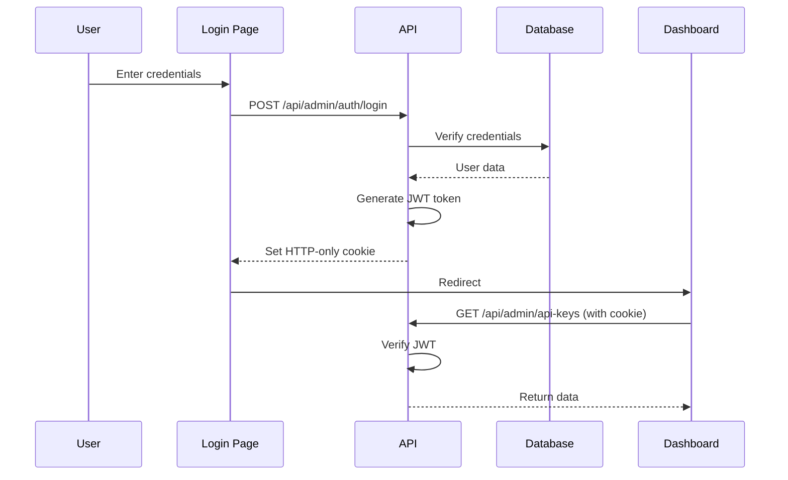

# Admin Dashboard - Complete Specification

**Project:** Key-Kingdom Admin Dashboard
**Version:** 1.0
**Last Updated:** 2025-11-23
**Status:** 📋 Planning Phase

---

## Table of Contents

1. [Executive Summary](#executive-summary)
2. [Goals & Objectives](#goals--objectives)
3. [User Personas](#user-personas)
4. [Feature Specifications](#feature-specifications)
5. [UI/UX Design](#uiux-design)
6. [Technical Architecture](#technical-architecture)
7. [Security & Authentication](#security--authentication)
8. [Implementation Roadmap](#implementation-roadmap)
9. [Progress Checklist](#progress-checklist)
10. [Testing Strategy](#testing-strategy)
11. [Success Metrics](#success-metrics)
12. [Future Enhancements](#future-enhancements)

---

## Executive Summary

The Admin Dashboard is a comprehensive web-based interface for managing Key-Kingdom's API keys, monitoring usage, and administering the executor marketplace. It provides administrators and developers with self-service tools to create, monitor, and manage API keys without requiring direct database access or API calls.

**Key Benefits:**
- Self-service API key management
- Real-time usage analytics
- Enhanced security with audit logging
- Improved developer experience
- Reduced administrative overhead

**Target Users:**
- Platform administrators
- API key consumers (Discord bot developers)
- Security team members
- System operators

---

## Goals & Objectives

### Primary Goals

1. **Self-Service Management**
   - Enable users to create and manage API keys independently
   - Eliminate need for manual database operations or API calls
   - Provide intuitive interface for common operations

2. **Visibility & Monitoring**
   - Real-time usage statistics and analytics
   - Activity audit logs
   - Performance metrics and health indicators

3. **Security & Compliance**
   - Secure authentication and authorization
   - Comprehensive audit trails
   - Role-based access control (RBAC)

4. **Developer Experience**
   - Clear, intuitive interface
   - Quick actions and workflows
   - Integrated documentation and help

### Success Criteria

- ✅ 90%+ of API key operations done via dashboard (vs. Prisma Studio/API)
- ✅ <2 second page load time for all views
- ✅ Zero security incidents related to key management
- ✅ 95%+ user satisfaction score
- ✅ <5 minute onboarding time for new users

---

## User Personas

### 1. Platform Administrator (Primary)

**Name:** Alex - Platform Admin
**Role:** Manages the entire Key-Kingdom platform
**Technical Level:** High
**Needs:**
- Complete control over all API keys
- System-wide analytics and monitoring
- User and team management
- Security audit capabilities

**Pain Points:**
- Manual database operations are time-consuming
- Difficult to track who created which keys
- No visibility into usage patterns

**Goals:**
- Efficiently manage 50+ API keys
- Monitor system health at a glance
- Respond quickly to security incidents

### 2. Discord Bot Developer (Secondary)

**Name:** Jordan - Bot Developer
**Role:** Builds Discord bots that integrate with Key-Kingdom
**Technical Level:** Medium
**Needs:**
- Quick API key creation
- Usage monitoring for their keys
- Documentation and examples
- Testing playground

**Pain Points:**
- Waiting for admin to create keys
- Can't see their own usage stats
- Unclear rate limits

**Goals:**
- Self-service key creation
- Monitor their bot's API usage
- Test API integration easily

### 3. Security Team Member (Tertiary)

**Name:** Morgan - Security Analyst
**Role:** Monitors platform security and compliance
**Technical Level:** High
**Needs:**
- Comprehensive audit logs
- Anomaly detection
- Quick revocation capabilities
- IP allowlisting

**Pain Points:**
- Limited visibility into API usage
- Manual security reviews
- Reactive instead of proactive monitoring

**Goals:**
- Detect suspicious activity early
- Audit key usage patterns
- Enforce security policies

---

## Feature Specifications

### 1. Authentication & Authorization

#### 1.1 Login System

**Route:** `/admin/login`

**Features:**
- Email + Password authentication
- JWT token-based sessions
- "Remember Me" functionality (30-day token)
- Password reset via email
- Session timeout after 24 hours (or 30 days if remembered)

**UI Components:**
- Login form with email and password fields
- "Forgot Password?" link
- "Remember Me" checkbox
- Social login (optional: Google, GitHub)

**Validation:**
- Email format validation
- Minimum password length (8 characters)
- Rate limiting: 5 attempts per 15 minutes
- CSRF protection

**Error Handling:**
- Invalid credentials: "Invalid email or password"
- Too many attempts: "Too many login attempts. Try again in 15 minutes."
- Expired session: Redirect to login with message

#### 1.2 User Registration (Admin-Only)

**Route:** `/admin/register` (protected)

**Features:**
- Admin can create new user accounts
- Invite-based registration with email verification
- Role assignment during creation
- Auto-generated temporary password

**User Roles:**
1. **Super Admin** - Full system access
2. **Admin** - Manage keys and users
3. **Developer** - Create and manage own keys only
4. **Viewer** - Read-only access

#### 1.3 Password Reset

**Route:** `/admin/reset-password`

**Flow:**
1. User enters email
2. System sends reset link (expires in 1 hour)
3. User clicks link, enters new password
4. Password updated, user redirected to login

---

### 2. Dashboard Overview

#### 2.1 Main Dashboard

**Route:** `/admin`

**Layout Sections:**

##### A. Top Metrics Bar
```
┌─────────────────────────────────────────────────────────────┐
│  📊 Quick Stats                                              │
│  ┌──────────────┐ ┌──────────────┐ ┌──────────────┐        │
│  │ 24 Active    │ │ 1.2M Requests│ │ 2 Alerts     │        │
│  │ API Keys     │ │ This Month   │ │ Require Action│       │
│  │ +2 this week │ │ +5.2% ↑      │ │ View →        │       │
│  └──────────────┘ └──────────────┘ └──────────────┘        │
└─────────────────────────────────────────────────────────────┘
```

**Metrics:**
- Total active API keys (with trend)
- Total requests this month (with % change)
- Active alerts count
- System health status

##### B. Usage Analytics Chart
```
┌─────────────────────────────────────────────────────────────┐
│  📈 API Usage (Last 30 Days)                    [Filter ▾]  │
│                                                               │
│  1M │                                    ╱╲                  │
│     │                          ╱╲      ╱  ╲                 │
│ 500k│                    ╱╲  ╱  ╲    ╱    ╲                │
│     │          ╱╲      ╱  ╲╱    ╲  ╱      ╲    ╱╲          │
│   0 └─────────────────────────────────────────────────────  │
│     Nov 1          Nov 15          Nov 30                    │
└─────────────────────────────────────────────────────────────┘
```

**Chart Features:**
- Line chart showing requests over time
- Time range selector: 24h, 7d, 30d, 90d, 1y
- Toggle between: Total requests, Successful, Failed, Rate limited
- Hover tooltips with exact values
- Export to PNG/CSV

##### C. Recent Activity Feed
```
┌─────────────────────────────────────────────────────────────┐
│  🕐 Recent Activity                             [View All →] │
│  ┌───────────────────────────────────────────────────────┐  │
│  │ ● Alex created API key "Production Bot" - 2m ago      │  │
│  │ ● System revoked key "Old Test" (expired) - 15m ago   │  │
│  │ ● Jordan's key hit rate limit - 1h ago                │  │
│  │ ● Morgan updated IP allowlist for "Admin Key" - 2h    │  │
│  └───────────────────────────────────────────────────────┘  │
└─────────────────────────────────────────────────────────────┘
```

**Activity Types:**
- Key created/revoked/updated
- Rate limit hits
- Authentication failures
- Configuration changes
- Security alerts

##### D. Alert Center
```
┌─────────────────────────────────────────────────────────────┐
│  ⚠️  Alerts & Notifications                                  │
│  ┌───────────────────────────────────────────────────────┐  │
│  │ 🟡 Key "Bot Alpha" approaching rate limit (85%)       │  │
│  │    [View Details] [Increase Limit]                     │  │
│  │                                                         │  │
│  │ 🔴 Key "Test Key" not used in 45 days                  │  │
│  │    [Revoke] [Keep Active]                              │  │
│  └───────────────────────────────────────────────────────┘  │
└─────────────────────────────────────────────────────────────┘
```

**Alert Types:**
- 🔴 Critical: Security issues, system errors
- 🟡 Warning: Approaching limits, expiring soon
- 🔵 Info: Updates, new features

---

### 3. API Keys Management

#### 3.1 API Keys List View

**Route:** `/admin/api-keys`

**Table Layout:**
```
┌─────────────────────────────────────────────────────────────┐
│  🔑 API Keys                                    [+ New Key]  │
│                                                               │
│  [Search by name...]  [Type ▾] [Status ▾] [Sort ▾]         │
│                                                               │
│  ┌───────────────────────────────────────────────────────┐  │
│  │ Name          Type     Status   Last Used    Actions   │  │
│  ├───────────────────────────────────────────────────────┤  │
│  │ 🟢 Prod Bot   Discord  Active   2m ago       [⋮]      │  │
│  │    kk_dis...d5da               1.2M requests           │  │
│  │                                                         │  │
│  │ 🟢 Dashboard  Admin    Active   5m ago       [⋮]      │  │
│  │    kk_adm...bb13               523 requests            │  │
│  │                                                         │  │
│  │ 🟡 Test Bot   Discord  Expiring  1h ago      [⋮]      │  │
│  │    kk_dis...c3d4               45 requests             │  │
│  │    Expires in 2 days                                   │  │
│  │                                                         │  │
│  │ 🔴 Old Bot    Discord  Revoked  30d ago      [View]   │  │
│  │    kk_dis...f6e5               156K requests           │  │
│  │    Revoked: Security breach                            │  │
│  └───────────────────────────────────────────────────────┘  │
│                                                               │
│  Showing 1-10 of 24 keys    [1] [2] [3] ... [Next →]       │
└─────────────────────────────────────────────────────────────┘
```

**Features:**

**Search & Filters:**
- Real-time search by name
- Filter by type: All, Discord Bot, Admin
- Filter by status: All, Active, Revoked, Expiring
- Filter by user (for admins)
- Date range filter

**Sorting:**
- Name (A-Z, Z-A)
- Created date (newest, oldest)
- Last used (recent, oldest)
- Total requests (high to low, low to high)
- Status (active first, revoked first)

**Bulk Actions:**
- Select multiple keys (checkboxes)
- Bulk revoke
- Bulk export to CSV
- Bulk update rate limits

**Status Indicators:**
- 🟢 Green: Active, healthy
- 🟡 Yellow: Expiring soon (<7 days) or approaching limit (>80%)
- 🔴 Red: Revoked or suspended
- ⚪ Gray: Never used

**Quick Actions Menu (⋮):**
- View details
- Copy key (if recently created)
- Edit name/notes
- Update rate limit
- Revoke key
- View usage stats
- Download .env snippet

**Pagination:**
- 10, 25, 50, 100 items per page
- Jump to page number
- Keyboard navigation (arrow keys)

#### 3.2 Create New API Key

**Route:** `/admin/api-keys/new` (Modal or dedicated page)

**Form Fields:**

```
┌─────────────────────────────────────────────────────────────┐
│  Create New API Key                                     [×]  │
│                                                               │
│  Name *                                                       │
│  [Production Discord Bot                               ]      │
│                                                               │
│  Type *                                                       │
│  ( ) Discord Bot API   (•) Admin API                         │
│                                                               │
│  Rate Limit Configuration                                    │
│  Requests: [100    ] per [60000   ] ms (1 minute)           │
│  Default: 100 req/min for Discord, 500 req/hour for Admin   │
│                                                               │
│  Expiration (Optional)                                       │
│  [ ] Never expires                                           │
│  [•] Expires on: [2025-12-31] [23:59]                       │
│                                                               │
│  Notes (Optional)                                            │
│  [Used for production Discord bot on server XYZ      ]       │
│  [                                                     ]       │
│                                                               │
│  Advanced Options                        [Show ▾]            │
│  ┌─────────────────────────────────────────────────────┐    │
│  │ IP Allowlist                                         │    │
│  │ [192.168.1.1                          ] [+ Add]     │    │
│  │ [10.0.0.0/24                          ] [Remove]    │    │
│  │                                                      │    │
│  │ Tags                                                 │    │
│  │ [production] [discord] [critical] [+ Add Tag]      │    │
│  └─────────────────────────────────────────────────────┘    │
│                                                               │
│  [Cancel]                              [Create API Key]      │
└─────────────────────────────────────────────────────────────┘
```

**Validation:**
- Name: Required, 3-100 characters
- Type: Required, must be valid type
- Rate limit: Positive integers only
- Expiration: Must be future date
- IP addresses: Valid IPv4/IPv6 or CIDR notation

**Success Modal:**
```
┌─────────────────────────────────────────────────────────────┐
│  ✅ API Key Created Successfully                        [×]  │
│                                                               │
│  ⚠️  IMPORTANT: Save this key securely!                      │
│  This is the only time it will be displayed.                 │
│                                                               │
│  ┌─────────────────────────────────────────────────────┐    │
│  │ kk_discord_a1b2c3d4e5f6g7h8i9j0k1l2m3n4o5p6q7r8s9  │    │
│  │                                            [Copy 📋] │    │
│  └─────────────────────────────────────────────────────┘    │
│                                                               │
│  Add to your .env file:                                      │
│  ┌─────────────────────────────────────────────────────┐    │
│  │ DISCORD_BOT_API_KEY="kk_discord_a1b2c3d4..."        │    │
│  │                                            [Copy 📋] │    │
│  └─────────────────────────────────────────────────────┘    │
│                                                               │
│  [Download .env snippet] [View Documentation]                │
│                                                               │
│  I have saved this key securely [Continue →]                 │
└─────────────────────────────────────────────────────────────┘
```

**Features:**
- One-time key display
- Copy to clipboard buttons
- Download as .env file snippet
- Automatic redirection after confirmation
- Email notification (optional)

#### 3.3 API Key Details View

**Route:** `/admin/api-keys/[id]`

**Page Layout:**

##### Header Section
```
┌─────────────────────────────────────────────────────────────┐
│  ← Back to API Keys                                          │
│                                                               │
│  🟢 Production Discord Bot                                   │
│  kk_discord_68d7...d5da                          [Copy 📋]  │
│                                                               │
│  Created: Nov 20, 2025 by Alex                              │
│  Last Used: 2 minutes ago                                    │
│                                                               │
│  [Edit Details] [Update Rate Limit] [Revoke Key]            │
└─────────────────────────────────────────────────────────────┘
```

##### Stats Cards
```
┌─────────────────────────────────────────────────────────────┐
│  ┌──────────────┐ ┌──────────────┐ ┌──────────────┐        │
│  │ 1.2M         │ │ 100 req/min  │ │ 45 hits      │        │
│  │ Total Reqs   │ │ Rate Limit   │ │ This Hour    │        │
│  │ +5.2% ↑      │ │ 85% used     │ │ Under limit  │        │
│  └──────────────┘ └──────────────┘ └──────────────┘        │
└─────────────────────────────────────────────────────────────┘
```

##### Tabs Section
```
┌─────────────────────────────────────────────────────────────┐
│  [Overview] [Usage] [Security] [Audit Log]                  │
│  ─────────                                                   │
│                                                               │
│  Details                                                     │
│  ┌─────────────────────────────────────────────────────┐    │
│  │ Name:        Production Discord Bot                  │    │
│  │ Type:        Discord Bot API                         │    │
│  │ Created:     Nov 20, 2025 10:30 AM                   │    │
│  │ Created By:  Alex (admin@keykingdom.org)            │    │
│  │ Last Used:   Nov 23, 2025 4:30 PM (2 min ago)       │    │
│  │ Expires:     Dec 31, 2025 11:59 PM (38 days)        │    │
│  │ Status:      🟢 Active                                │    │
│  │                                                       │    │
│  │ Rate Limit:  100 requests per 60000ms (1 minute)    │    │
│  │ Window:      Rolling window                          │    │
│  │                                                       │    │
│  │ Tags:        [production] [discord] [critical]      │    │
│  │                                                       │    │
│  │ Notes:       Used for production Discord bot on      │    │
│  │              server XYZ. Contact Jordan for access.  │    │
│  └─────────────────────────────────────────────────────┘    │
│                                                               │
│  IP Allowlist                                                │
│  ┌─────────────────────────────────────────────────────┐    │
│  │ 192.168.1.1                             [Remove]     │    │
│  │ 10.0.0.0/24                             [Remove]     │    │
│  │                                                       │    │
│  │ [+ Add IP Address]                                   │    │
│  └─────────────────────────────────────────────────────┘    │
└─────────────────────────────────────────────────────────────┘
```

**Tab: Usage**
```
┌─────────────────────────────────────────────────────────────┐
│  Usage Analytics                          [7 days ▾]         │
│                                                               │
│  Requests Over Time                                          │
│  [Line chart showing request volume]                         │
│                                                               │
│  Top Endpoints                                               │
│  /api/discord/executors           847K (70.5%)               │
│  /api/discord/search              235K (19.6%)               │
│  /api/discord/platform-status     118K (9.9%)                │
│                                                               │
│  Response Status Distribution                                │
│  🟢 2xx Success:     1.15M (95.8%)                           │
│  🟡 4xx Client Error: 42K (3.5%)                             │
│  🔴 5xx Server Error:  8K (0.7%)                             │
│                                                               │
│  [Export Data] [View Full Report]                            │
└─────────────────────────────────────────────────────────────┘
```

**Tab: Security**
```
┌─────────────────────────────────────────────────────────────┐
│  Security Settings                                           │
│                                                               │
│  Authentication Events                                       │
│  ┌─────────────────────────────────────────────────────┐    │
│  │ ✅ Last successful auth: 2 min ago from 192.168.1.1  │    │
│  │ ⚠️  3 failed attempts in last 24h                     │    │
│  │    - 10:30 AM from 203.0.113.5                       │    │
│  │    - 10:31 AM from 203.0.113.5                       │    │
│  │    - 10:32 AM from 203.0.113.5                       │    │
│  └─────────────────────────────────────────────────────┘    │
│                                                               │
│  IP Access Control                                           │
│  [•] Allowlist enabled (2 IPs)                              │
│  [ ] Block suspicious IPs automatically                      │
│                                                               │
│  Rate Limit Protection                                       │
│  [•] Enabled (100 req/min)                                  │
│  [•] Alert when 80% threshold reached                        │
│  [ ] Temporarily increase limit during high traffic          │
│                                                               │
│  [Save Changes]                                              │
└─────────────────────────────────────────────────────────────┘
```

**Tab: Audit Log**
```
┌─────────────────────────────────────────────────────────────┐
│  Audit Log                                [Export CSV]       │
│                                                               │
│  [All Events ▾] [Last 30 days ▾]                            │
│                                                               │
│  ┌─────────────────────────────────────────────────────┐    │
│  │ Nov 23, 4:30 PM - API request successful             │    │
│  │ Endpoint: /api/discord/executors/synapse             │    │
│  │ IP: 192.168.1.1 | Response: 200 | Duration: 45ms     │    │
│  │                                                       │    │
│  │ Nov 23, 4:28 PM - API request successful             │    │
│  │ Endpoint: /api/discord/search?q=executor             │    │
│  │ IP: 192.168.1.1 | Response: 200 | Duration: 125ms    │    │
│  │                                                       │    │
│  │ Nov 23, 10:30 AM - Rate limit updated                │    │
│  │ Changed from 50 req/min to 100 req/min              │    │
│  │ Updated by: Alex (admin@keykingdom.org)             │    │
│  │                                                       │    │
│  │ Nov 20, 10:30 AM - API key created                   │    │
│  │ Created by: Alex (admin@keykingdom.org)             │    │
│  └─────────────────────────────────────────────────────┘    │
│                                                               │
│  [Load More]                                                 │
└─────────────────────────────────────────────────────────────┘
```

#### 3.4 Revoke API Key

**Modal:**
```
┌─────────────────────────────────────────────────────────────┐
│  ⚠️  Revoke API Key                                     [×]  │
│                                                               │
│  Are you sure you want to revoke this API key?              │
│                                                               │
│  Key: kk_discord_68d7...d5da                                │
│  Name: Production Discord Bot                                │
│                                                               │
│  This action cannot be undone. All requests using this key  │
│  will be rejected immediately.                               │
│                                                               │
│  Reason for revocation:                                      │
│  (•) Security concern                                        │
│  ( ) No longer needed                                        │
│  ( ) Key rotation                                            │
│  ( ) Other: [                                        ]       │
│                                                               │
│  Additional notes (optional):                                │
│  [Suspected unauthorized access from unknown IPs     ]       │
│  [                                                     ]       │
│                                                               │
│  [Cancel]                  [Revoke Key]                      │
└─────────────────────────────────────────────────────────────┘
```

---

### 4. Analytics & Monitoring

#### 4.1 System Analytics

**Route:** `/admin/analytics`

**Page Sections:**

##### Global Metrics
```
┌─────────────────────────────────────────────────────────────┐
│  System Analytics                         [Last 30 days ▾]  │
│                                                               │
│  ┌──────────────┐ ┌──────────────┐ ┌──────────────┐        │
│  │ 2.4M         │ │ 156 avg/sec  │ │ 99.8%        │        │
│  │ Total Reqs   │ │ Request Rate │ │ Success Rate │        │
│  │ +12.5% ↑     │ │ +5.2% ↑      │ │ -0.1% ↓      │        │
│  └──────────────┘ └──────────────┘ └──────────────┘        │
└─────────────────────────────────────────────────────────────┘
```

##### Request Volume Chart
```
┌─────────────────────────────────────────────────────────────┐
│  Request Volume Over Time                                    │
│                                                               │
│  [Area chart showing total requests with breakdown]          │
│  Legend: [Total] [Discord API] [Admin API]                  │
│                                                               │
│  Time Range: [24h] [7d] [30d] [90d] [1y] [Custom]          │
└─────────────────────────────────────────────────────────────┘
```

##### Top API Keys
```
┌─────────────────────────────────────────────────────────────┐
│  Top 10 API Keys by Usage                                    │
│  ┌─────────────────────────────────────────────────────┐    │
│  │ 1. Production Bot        847K requests (35.3%)      │    │
│  │ 2. Dashboard Admin       523K requests (21.8%)      │    │
│  │ 3. Bot Alpha             312K requests (13.0%)      │    │
│  │ 4. Integration Test      156K requests (6.5%)       │    │
│  │ 5. Backup Bot            98K requests (4.1%)        │    │
│  │ ...                                                  │    │
│  └─────────────────────────────────────────────────────┘    │
└─────────────────────────────────────────────────────────────┘
```

##### Endpoint Performance
```
┌─────────────────────────────────────────────────────────────┐
│  Endpoint Performance                                        │
│  ┌─────────────────────────────────────────────────────┐    │
│  │ Endpoint                  Calls  Avg Time  Errors   │    │
│  ├─────────────────────────────────────────────────────┤    │
│  │ /api/discord/executors    1.2M   45ms     0.2%      │    │
│  │ /api/discord/search       523K   125ms    0.5%      │    │
│  │ /api/discord/platform...  312K   32ms     0.1%      │    │
│  └─────────────────────────────────────────────────────┘    │
└─────────────────────────────────────────────────────────────┘
```

##### Error Rate Chart
```
┌─────────────────────────────────────────────────────────────┐
│  Error Rate Trends                                           │
│  [Stacked area chart: 4xx errors, 5xx errors, rate limits]  │
└─────────────────────────────────────────────────────────────┘
```

#### 4.2 Export & Reports

**Features:**
- Export to CSV, JSON, or Excel
- Schedule automated reports (daily, weekly, monthly)
- Email reports to stakeholders
- Custom date ranges
- Filter by API key, endpoint, status code

---

### 5. User Management

#### 5.1 Users List

**Route:** `/admin/users` (Super Admin only)

**Table:**
```
┌─────────────────────────────────────────────────────────────┐
│  👥 Users                                      [+ Add User]  │
│                                                               │
│  [Search...]  [Role ▾] [Status ▾]                           │
│                                                               │
│  ┌─────────────────────────────────────────────────────┐    │
│  │ Name         Email              Role    Status  [⋮]  │    │
│  ├─────────────────────────────────────────────────────┤    │
│  │ Alex Admin   admin@kk.org      Admin   Active  [⋮]  │    │
│  │              Last login: 5m ago          2 keys      │    │
│  │                                                       │    │
│  │ Jordan Dev   jordan@example.com Dev     Active  [⋮]  │    │
│  │              Last login: 2h ago          1 key       │    │
│  │                                                       │    │
│  │ Morgan Sec   morgan@kk.org     Viewer  Active  [⋮]  │    │
│  │              Last login: 1d ago          0 keys      │    │
│  └─────────────────────────────────────────────────────┘    │
└─────────────────────────────────────────────────────────────┘
```

**User Actions:**
- View details
- Edit role
- Suspend/Activate account
- Reset password
- View owned API keys
- View activity log

#### 5.2 Add/Edit User

**Form:**
- Name (required)
- Email (required, unique)
- Role (required)
- Generate temporary password
- Send invite email

---

### 6. Settings & Configuration

#### 6.1 Profile Settings

**Route:** `/admin/settings/profile`

**Sections:**
- Personal information (name, email)
- Change password
- Email preferences
- Two-factor authentication
- API access (personal API keys)

#### 6.2 System Settings

**Route:** `/admin/settings/system` (Super Admin only)

**Configuration:**
- Default rate limits
- Session timeout duration
- Email notifications settings
- Maintenance mode
- Audit log retention period
- Auto-revoke expired keys

#### 6.3 Notification Settings

**Route:** `/admin/settings/notifications`

**Preferences:**
- Email notifications
  - New API key created
  - Key approaching expiration
  - Rate limit exceeded
  - Security alerts
- In-app notifications
- Webhook notifications (future)

---

### 7. Help & Documentation

#### 7.1 Inline Help

**Features:**
- Contextual tooltips (?)
- Help text under form fields
- Validation error messages
- Success/info banners

#### 7.2 Documentation Center

**Route:** `/admin/help`

**Sections:**
- Getting started guide
- API key management tutorial
- Security best practices
- Troubleshooting guide
- API documentation links
- FAQ
- Contact support

---

## UI/UX Design

### Design System

#### Colors

**Brand Colors:**
```css
--primary: #5865F2;        /* Discord Blurple - Primary actions */
--primary-hover: #4752C4;  /* Darker blurple for hover */
--primary-light: #7289DA;  /* Lighter shade */
```

**Background Colors:**
```css
--bg-primary: #0B0E11;     /* Main background */
--bg-secondary: #151A21;   /* Cards, panels */
--bg-tertiary: #1E2329;    /* Hover states, elevated elements */
--bg-hover: #252B33;       /* Interactive hover */
```

**Status Colors:**
```css
--success: #43B581;        /* Green - Active, success */
--warning: #FAA61A;        /* Amber - Warning, expiring */
--danger: #F04747;         /* Red - Error, revoked */
--info: #3498DB;           /* Blue - Information */
--gray: #99AAB5;           /* Gray - Inactive, disabled */
```

**Text Colors:**
```css
--text-primary: #FFFFFF;   /* Primary text */
--text-secondary: #B9BBBE; /* Secondary text */
--text-muted: #72767D;     /* Muted text, labels */
--text-link: #00B0F4;      /* Links */
```

#### Typography

**Font Family:**
```css
--font-sans: 'Inter', -apple-system, BlinkMacSystemFont, 'Segoe UI', sans-serif;
--font-mono: 'JetBrains Mono', 'Fira Code', 'Courier New', monospace;
```

**Font Sizes:**
```css
--text-xs: 0.75rem;    /* 12px - Small labels */
--text-sm: 0.875rem;   /* 14px - Body text */
--text-base: 1rem;     /* 16px - Default */
--text-lg: 1.125rem;   /* 18px - Subheadings */
--text-xl: 1.25rem;    /* 20px - Headings */
--text-2xl: 1.5rem;    /* 24px - Page titles */
--text-3xl: 1.875rem;  /* 30px - Hero text */
```

**Font Weights:**
```css
--font-normal: 400;
--font-medium: 500;
--font-semibold: 600;
--font-bold: 700;
```

#### Spacing

**Scale:**
```css
--space-1: 0.25rem;   /* 4px */
--space-2: 0.5rem;    /* 8px */
--space-3: 0.75rem;   /* 12px */
--space-4: 1rem;      /* 16px */
--space-5: 1.25rem;   /* 20px */
--space-6: 1.5rem;    /* 24px */
--space-8: 2rem;      /* 32px */
--space-10: 2.5rem;   /* 40px */
--space-12: 3rem;     /* 48px */
```

#### Border Radius

```css
--radius-sm: 0.25rem;  /* 4px - Small elements */
--radius-md: 0.5rem;   /* 8px - Buttons, inputs */
--radius-lg: 0.75rem;  /* 12px - Cards */
--radius-xl: 1rem;     /* 16px - Modals */
--radius-2xl: 1.5rem;  /* 24px - Large containers */
--radius-full: 9999px; /* Full round - Pills, avatars */
```

#### Shadows

```css
--shadow-sm: 0 1px 2px 0 rgba(0, 0, 0, 0.3);
--shadow-md: 0 4px 6px -1px rgba(0, 0, 0, 0.4);
--shadow-lg: 0 10px 15px -3px rgba(0, 0, 0, 0.5);
--shadow-xl: 0 20px 25px -5px rgba(0, 0, 0, 0.6);
```

### Component Library

#### Buttons

**Primary Button:**
```tsx
<button className="btn-primary">
  Create API Key
</button>

// CSS
.btn-primary {
  background: var(--primary);
  color: white;
  padding: 0.5rem 1rem;
  border-radius: var(--radius-md);
  font-weight: 600;
  transition: all 0.2s;
}
.btn-primary:hover {
  background: var(--primary-hover);
  transform: translateY(-1px);
}
```

**Secondary Button:**
```tsx
<button className="btn-secondary">
  Cancel
</button>

// CSS
.btn-secondary {
  background: var(--bg-tertiary);
  color: var(--text-primary);
  border: 1px solid var(--bg-hover);
}
```

**Danger Button:**
```tsx
<button className="btn-danger">
  Revoke Key
</button>

// CSS
.btn-danger {
  background: var(--danger);
  color: white;
}
```

#### Inputs

**Text Input:**
```tsx
<input
  type="text"
  className="input"
  placeholder="Enter API key name..."
/>

// CSS
.input {
  background: var(--bg-tertiary);
  border: 1px solid var(--bg-hover);
  color: var(--text-primary);
  padding: 0.625rem 0.875rem;
  border-radius: var(--radius-md);
  font-size: var(--text-sm);
}
.input:focus {
  outline: 2px solid var(--primary);
  outline-offset: 2px;
}
```

**Search Input:**
```tsx
<div className="search-input">
  <SearchIcon />
  <input type="text" placeholder="Search..." />
</div>
```

#### Cards

```tsx
<div className="card">
  <div className="card-header">
    <h3>API Key Details</h3>
  </div>
  <div className="card-body">
    {/* Content */}
  </div>
</div>

// CSS
.card {
  background: var(--bg-secondary);
  border-radius: var(--radius-lg);
  box-shadow: var(--shadow-md);
  overflow: hidden;
}
.card-header {
  padding: var(--space-4) var(--space-6);
  border-bottom: 1px solid var(--bg-tertiary);
}
```

#### Badges

```tsx
<span className="badge badge-success">Active</span>
<span className="badge badge-warning">Expiring</span>
<span className="badge badge-danger">Revoked</span>

// CSS
.badge {
  display: inline-flex;
  align-items: center;
  padding: 0.25rem 0.625rem;
  border-radius: var(--radius-full);
  font-size: var(--text-xs);
  font-weight: 600;
}
.badge-success {
  background: rgba(67, 181, 129, 0.1);
  color: var(--success);
}
```

#### Tables

```tsx
<table className="table">
  <thead>
    <tr>
      <th>Name</th>
      <th>Type</th>
      <th>Status</th>
    </tr>
  </thead>
  <tbody>
    <tr>
      <td>Production Bot</td>
      <td>Discord</td>
      <td><span className="badge badge-success">Active</span></td>
    </tr>
  </tbody>
</table>

// CSS
.table {
  width: 100%;
  border-collapse: collapse;
}
.table th {
  text-align: left;
  padding: var(--space-3) var(--space-4);
  font-weight: 600;
  font-size: var(--text-xs);
  text-transform: uppercase;
  color: var(--text-muted);
}
.table td {
  padding: var(--space-4);
  border-top: 1px solid var(--bg-tertiary);
}
.table tr:hover {
  background: var(--bg-hover);
}
```

### Responsive Design

#### Breakpoints

```css
--mobile: 640px;    /* Small phones */
--tablet: 768px;    /* Tablets */
--desktop: 1024px;  /* Desktop */
--wide: 1280px;     /* Wide desktop */
--ultra: 1536px;    /* Ultra-wide */
```

#### Mobile Adaptations

**Navigation:**
- Hamburger menu on mobile
- Drawer-style navigation
- Bottom navigation bar (optional)

**Tables:**
- Convert to card layout on mobile
- Stack cells vertically
- Hide non-essential columns

**Forms:**
- Full-width inputs
- Larger touch targets (min 44x44px)
- Simplified multi-step forms

**Charts:**
- Responsive SVG charts
- Simplified mobile views
- Horizontal scroll for tables

### Accessibility

**WCAG 2.1 Level AA Compliance:**

- ✅ Keyboard navigation for all interactive elements
- ✅ Focus indicators (2px outline)
- ✅ ARIA labels and roles
- ✅ Color contrast ratio > 4.5:1
- ✅ Screen reader support
- ✅ Skip to content links
- ✅ Form labels and error messages
- ✅ Alt text for images/icons

**Keyboard Shortcuts:**
- `Ctrl/Cmd + K` - Quick search
- `N` - New API key
- `Esc` - Close modal/drawer
- `?` - Show keyboard shortcuts
- `G then D` - Go to dashboard
- `G then K` - Go to API keys

---

## Technical Architecture

### Technology Stack

**Frontend:**
- **Framework:** Next.js 16.0.3 (App Router)
- **React:** 19.2.0
- **TypeScript:** ^5
- **Styling:** TailwindCSS 4
- **UI Components:** Custom + Shadcn/ui patterns
- **Icons:** Lucide React 0.554.0
- **Animations:** Framer Motion 12.23.24
- **Forms:** React Hook Form + Zod validation
- **State Management:**
  - React Query (server state)
  - Zustand (client state)
- **Charts:** Recharts or Chart.js
- **Date Handling:** date-fns 4.1.0

**Backend:**
- **API:** Next.js API Routes
- **Database:** SQLite (dev) → PostgreSQL (prod)
- **ORM:** Prisma 7.0.0 with LibSQL adapter
- **Authentication:** JWT tokens + HTTP-only cookies
- **Rate Limiting:** In-memory (dev) → Redis (prod)

**DevOps:**
- **Hosting:** Vercel (or self-hosted)
- **Database:** Turso (LibSQL) or PostgreSQL
- **CI/CD:** GitHub Actions
- **Monitoring:** Vercel Analytics + Custom metrics

### Folder Structure

```
/home/user/realProjKeyKingdom/
├── src/
│   ├── app/
│   │   ├── admin/
│   │   │   ├── layout.tsx              # Admin layout with sidebar
│   │   │   ├── page.tsx                # Dashboard overview
│   │   │   ├── login/
│   │   │   │   └── page.tsx            # Login page
│   │   │   ├── api-keys/
│   │   │   │   ├── page.tsx            # API keys list
│   │   │   │   ├── new/
│   │   │   │   │   └── page.tsx        # Create new key
│   │   │   │   └── [id]/
│   │   │   │       └── page.tsx        # Key details
│   │   │   ├── analytics/
│   │   │   │   └── page.tsx            # Analytics dashboard
│   │   │   ├── users/
│   │   │   │   ├── page.tsx            # Users list
│   │   │   │   └── [id]/
│   │   │   │       └── page.tsx        # User details
│   │   │   ├── settings/
│   │   │   │   ├── profile/
│   │   │   │   ├── system/
│   │   │   │   └── notifications/
│   │   │   └── help/
│   │   │       └── page.tsx            # Help center
│   │   │
│   │   └── api/
│   │       └── admin/
│   │           ├── auth/               # Auth endpoints
│   │           ├── api-keys/           # API key management (existing)
│   │           ├── users/              # User management
│   │           ├── analytics/          # Analytics data
│   │           └── settings/           # Settings management
│   │
│   ├── components/
│   │   ├── admin/
│   │   │   ├── layout/
│   │   │   │   ├── AdminLayout.tsx
│   │   │   │   ├── Sidebar.tsx
│   │   │   │   ├── Header.tsx
│   │   │   │   └── MobileNav.tsx
│   │   │   ├── dashboard/
│   │   │   │   ├── MetricsCard.tsx
│   │   │   │   ├── UsageChart.tsx
│   │   │   │   ├── ActivityFeed.tsx
│   │   │   │   └── AlertCenter.tsx
│   │   │   ├── api-keys/
│   │   │   │   ├── ApiKeyTable.tsx
│   │   │   │   ├── ApiKeyRow.tsx
│   │   │   │   ├── CreateKeyModal.tsx
│   │   │   │   ├── KeyDetailsView.tsx
│   │   │   │   ├── RevokeKeyModal.tsx
│   │   │   │   └── KeyBadge.tsx
│   │   │   ├── analytics/
│   │   │   │   ├── LineChart.tsx
│   │   │   │   ├── BarChart.tsx
│   │   │   │   ├── PieChart.tsx
│   │   │   │   └── StatCard.tsx
│   │   │   ├── users/
│   │   │   │   ├── UserTable.tsx
│   │   │   │   ├── UserForm.tsx
│   │   │   │   └── RoleSelector.tsx
│   │   │   └── common/
│   │   │       ├── LoadingSpinner.tsx
│   │   │       ├── EmptyState.tsx
│   │   │       ├── ErrorBoundary.tsx
│   │   │       └── ConfirmModal.tsx
│   │   │
│   │   └── ui/                         # Reusable UI components
│   │       ├── Button.tsx
│   │       ├── Input.tsx
│   │       ├── Card.tsx
│   │       ├── Badge.tsx
│   │       ├── Table.tsx
│   │       ├── Modal.tsx
│   │       ├── Dropdown.tsx
│   │       ├── Toast.tsx
│   │       └── Tooltip.tsx
│   │
│   ├── lib/
│   │   ├── admin/
│   │   │   ├── auth.ts                 # Admin auth helpers
│   │   │   ├── permissions.ts          # RBAC logic
│   │   │   └── session.ts              # Session management
│   │   ├── hooks/
│   │   │   ├── useApiKeys.ts           # API keys React Query hooks
│   │   │   ├── useAnalytics.ts         # Analytics hooks
│   │   │   ├── useAuth.ts              # Auth hooks
│   │   │   └── useUsers.ts             # User management hooks
│   │   └── utils/
│   │       ├── formatters.ts           # Date, number formatting
│   │       ├── validators.ts           # Form validation
│   │       └── api-client.ts           # API client wrapper
│   │
│   ├── types/
│   │   ├── admin.ts                    # Admin-specific types
│   │   ├── api-keys.ts                 # API key types
│   │   └── analytics.ts                # Analytics types
│   │
│   └── styles/
│       └── admin.css                   # Admin-specific styles
│
├── prisma/
│   ├── schema.prisma                   # Database schema (existing)
│   └── migrations/                     # Database migrations
│
├── docs/
│   └── features/
│       └── ADMIN_DASHBOARD_SPEC.md     # This document
│
└── package.json
```

### Database Schema Updates

**New Tables:**

```prisma
// User accounts for dashboard access
model User {
  id            String   @id @default(uuid())
  email         String   @unique
  name          String
  passwordHash  String
  role          String   @default("developer") // super_admin, admin, developer, viewer

  createdAt     DateTime @default(now())
  updatedAt     DateTime @updatedAt
  lastLoginAt   DateTime?

  // Two-factor authentication
  twoFactorEnabled Boolean @default(false)
  twoFactorSecret  String?

  // Relations
  createdApiKeys ApiKey[] @relation("CreatedKeys")
  activities     AdminAction[]

  @@map("users")
}

// Sessions for dashboard auth
model Session {
  id           String   @id @default(uuid())
  userId       String
  token        String   @unique
  expiresAt    DateTime
  createdAt    DateTime @default(now())
  lastActivity DateTime @default(now())
  ipAddress    String?
  userAgent    String?

  user         User     @relation(fields: [userId], references: [id], onDelete: Cascade)

  @@index([userId])
  @@index([token])
  @@map("sessions")
}

// Notification preferences
model NotificationPreference {
  id                    String  @id @default(uuid())
  userId                String  @unique

  emailKeyCreated       Boolean @default(true)
  emailKeyRevoked       Boolean @default(true)
  emailKeyExpiring      Boolean @default(true)
  emailRateLimitHit     Boolean @default(true)
  emailSecurityAlert    Boolean @default(true)

  inAppEnabled          Boolean @default(true)

  user                  User    @relation(fields: [userId], references: [id], onDelete: Cascade)

  @@map("notification_preferences")
}

// In-app notifications
model Notification {
  id          String   @id @default(uuid())
  userId      String
  type        String   // key_created, key_revoked, rate_limit, security_alert
  title       String
  message     String
  read        Boolean  @default(false)
  actionUrl   String?
  createdAt   DateTime @default(now())

  user        User     @relation(fields: [userId], references: [id], onDelete: Cascade)

  @@index([userId, read])
  @@map("notifications")
}
```

**Schema Updates to Existing Tables:**

```prisma
// Add userId to ApiKey model
model ApiKey {
  // ... existing fields

  createdBy   String?  // User ID who created the key
  creator     User?    @relation("CreatedKeys", fields: [createdBy], references: [id])

  @@index([createdBy])
}

// Add userId to AdminAction model
model AdminAction {
  // ... existing fields

  user        User?    @relation(fields: [userId], references: [id])
}
```

### API Endpoints

**Authentication:**
- `POST /api/admin/auth/login` - Login
- `POST /api/admin/auth/logout` - Logout
- `POST /api/admin/auth/refresh` - Refresh token
- `POST /api/admin/auth/reset-password` - Request password reset
- `POST /api/admin/auth/verify-reset-token` - Verify reset token
- `PUT /api/admin/auth/update-password` - Update password

**API Keys (Existing + New):**
- `GET /api/admin/api-keys` - List keys (with pagination, filtering)
- `POST /api/admin/api-keys` - Create key
- `GET /api/admin/api-keys/:id` - Get key details
- `PATCH /api/admin/api-keys/:id` - Update key
- `DELETE /api/admin/api-keys/:id` - Revoke key
- `GET /api/admin/api-keys/:id/usage` - Get usage stats (NEW)
- `GET /api/admin/api-keys/:id/audit-log` - Get audit log (NEW)

**Analytics:**
- `GET /api/admin/analytics/overview` - Global metrics
- `GET /api/admin/analytics/usage` - Usage over time
- `GET /api/admin/analytics/endpoints` - Endpoint performance
- `GET /api/admin/analytics/keys` - Top keys by usage
- `GET /api/admin/analytics/export` - Export data

**Users:**
- `GET /api/admin/users` - List users
- `POST /api/admin/users` - Create user
- `GET /api/admin/users/:id` - Get user details
- `PATCH /api/admin/users/:id` - Update user
- `DELETE /api/admin/users/:id` - Delete user
- `PUT /api/admin/users/:id/role` - Update role

**Settings:**
- `GET /api/admin/settings/profile` - Get profile
- `PUT /api/admin/settings/profile` - Update profile
- `GET /api/admin/settings/notifications` - Get notification prefs
- `PUT /api/admin/settings/notifications` - Update notification prefs
- `GET /api/admin/settings/system` - Get system settings
- `PUT /api/admin/settings/system` - Update system settings

**Notifications:**
- `GET /api/admin/notifications` - List notifications
- `PUT /api/admin/notifications/:id/read` - Mark as read
- `DELETE /api/admin/notifications/:id` - Delete notification
- `PUT /api/admin/notifications/read-all` - Mark all as read

### State Management

**React Query (Server State):**
```typescript
// API keys
useQuery(['api-keys'], fetchApiKeys)
useQuery(['api-keys', id], () => fetchApiKey(id))
useMutation(createApiKey)
useMutation(revokeApiKey)

// Analytics
useQuery(['analytics', 'overview'], fetchOverview)
useQuery(['analytics', 'usage', { range }], () => fetchUsage(range))

// Users
useQuery(['users'], fetchUsers)
useMutation(createUser)
```

**Zustand (Client State):**
```typescript
// UI state
interface AdminStore {
  sidebarOpen: boolean;
  toggleSidebar: () => void;

  currentView: 'table' | 'cards';
  setView: (view: string) => void;

  filters: ApiKeyFilters;
  setFilters: (filters: ApiKeyFilters) => void;
}
```

### Authentication Flow



**JWT Payload:**
```json
{
  "userId": "uuid",
  "email": "admin@keykingdom.org",
  "role": "admin",
  "iat": 1700000000,
  "exp": 1700086400
}
```

**Session Storage:**
- HTTP-only cookies (secure, SameSite=Strict)
- 24-hour expiration (standard)
- 30-day expiration (with "Remember Me")
- Refresh token rotation

---

## Security & Authentication

### Authentication Requirements

1. **Password Policy:**
   - Minimum 8 characters
   - At least one uppercase letter
   - At least one lowercase letter
   - At least one number
   - At least one special character
   - No common passwords (check against list)

2. **Password Hashing:**
   - bcrypt with 12 rounds
   - Salt per password
   - Never store plain text

3. **Session Security:**
   - HTTP-only cookies
   - Secure flag (HTTPS only)
   - SameSite=Strict
   - CSRF tokens for state-changing operations

4. **Rate Limiting:**
   - Login: 5 attempts per 15 minutes per IP
   - Password reset: 3 requests per hour per email
   - API endpoints: 100 requests per minute per user

### Authorization (RBAC)

**Roles & Permissions:**

| Feature | Super Admin | Admin | Developer | Viewer |
|---------|-------------|-------|-----------|--------|
| View dashboard | ✅ | ✅ | ✅ | ✅ |
| View all API keys | ✅ | ✅ | ❌ (own only) | ✅ |
| Create API keys | ✅ | ✅ | ✅ (own only) | ❌ |
| Revoke any key | ✅ | ✅ | ❌ (own only) | ❌ |
| View analytics | ✅ | ✅ | ✅ (own keys) | ✅ |
| Manage users | ✅ | ✅ | ❌ | ❌ |
| System settings | ✅ | ❌ | ❌ | ❌ |
| Audit logs | ✅ | ✅ | ❌ (own only) | ✅ |

**Permission Middleware:**
```typescript
async function requirePermission(
  req: NextRequest,
  permission: Permission
): Promise<AuthResult> {
  const session = await getSession(req);

  if (!session) {
    return { authorized: false, error: 'Not authenticated' };
  }

  const hasPermission = checkPermission(session.role, permission);

  if (!hasPermission) {
    return { authorized: false, error: 'Insufficient permissions' };
  }

  return { authorized: true, user: session.user };
}
```

### Security Best Practices

1. **Input Validation:**
   - Validate all user inputs
   - Sanitize HTML/SQL
   - Use Zod schemas for validation

2. **XSS Prevention:**
   - Content Security Policy (CSP) headers
   - Escape user-generated content
   - Use React's built-in XSS protection

3. **CSRF Protection:**
   - CSRF tokens for all state-changing requests
   - SameSite cookies
   - Double-submit cookie pattern

4. **SQL Injection:**
   - Use Prisma's parameterized queries
   - Never concatenate SQL strings
   - Validate input types

5. **Audit Logging:**
   - Log all authentication attempts
   - Log all key creation/revocation
   - Log permission changes
   - Log system configuration changes

6. **Encryption:**
   - HTTPS only in production
   - Encrypt sensitive data at rest
   - Use secure random generators

---

## Implementation Roadmap

### Phase 1: Foundation (Week 1-2)
**Goal:** Basic dashboard infrastructure and authentication

**Deliverables:**
- Login/logout system
- Admin layout with sidebar
- Dashboard overview page
- Basic routing structure

### Phase 2: API Key Management (Week 3-4)
**Goal:** Core API key CRUD operations

**Deliverables:**
- API keys list view
- Create new key modal
- Key details page
- Revoke key functionality
- Search and filtering

### Phase 3: Analytics (Week 5-6)
**Goal:** Usage analytics and monitoring

**Deliverables:**
- Usage charts and graphs
- Top keys by usage
- Endpoint performance metrics
- Export functionality

### Phase 4: Advanced Features (Week 7-8)
**Goal:** User management and settings

**Deliverables:**
- User management (CRUD)
- Role-based access control
- Settings pages
- Notification system

### Phase 5: Polish & Testing (Week 9-10)
**Goal:** Production readiness

**Deliverables:**
- Mobile responsiveness
- Accessibility improvements
- Performance optimization
- Comprehensive testing
- Documentation

---

## Progress Checklist

### 📋 Phase 1: Foundation

#### Authentication System
- [ ] **Login Page** (`/admin/login`)
  - [ ] Create login page UI
  - [ ] Email + password form
  - [ ] "Remember me" checkbox
  - [ ] "Forgot password" link
  - [ ] Form validation with Zod
  - [ ] Error handling and display
  - [ ] Loading states

- [ ] **Auth API Endpoints**
  - [ ] `POST /api/admin/auth/login` - Login endpoint
  - [ ] `POST /api/admin/auth/logout` - Logout endpoint
  - [ ] `POST /api/admin/auth/refresh` - Refresh token
  - [ ] JWT token generation
  - [ ] Password hashing (bcrypt)
  - [ ] Session creation and storage
  - [ ] HTTP-only cookie handling

- [ ] **Password Reset Flow**
  - [ ] Reset password request page
  - [ ] `POST /api/admin/auth/reset-password` endpoint
  - [ ] Email sending integration (optional)
  - [ ] Reset token generation
  - [ ] Reset password confirmation page
  - [ ] `PUT /api/admin/auth/update-password` endpoint

- [ ] **Auth Helpers**
  - [ ] `getSession()` helper
  - [ ] `requireAuth()` middleware
  - [ ] `checkPermission()` utility
  - [ ] JWT verification
  - [ ] Session refresh logic

#### Database Setup
- [ ] **User Model**
  - [ ] Add User model to Prisma schema
  - [ ] Add Session model to Prisma schema
  - [ ] Create database migration
  - [ ] Add seed data for initial admin user
  - [ ] Test user CRUD operations

- [ ] **Schema Updates**
  - [ ] Add userId to ApiKey model
  - [ ] Update AdminAction relations
  - [ ] Add NotificationPreference model
  - [ ] Add Notification model
  - [ ] Run migrations

#### Admin Layout
- [ ] **Main Layout** (`/admin/layout.tsx`)
  - [ ] Create AdminLayout component
  - [ ] Sidebar navigation
  - [ ] Top header with user menu
  - [ ] Mobile hamburger menu
  - [ ] Responsive breakpoints
  - [ ] Auth protection wrapper

- [ ] **Sidebar Component**
  - [ ] Navigation menu items
  - [ ] Active state highlighting
  - [ ] Icons for each section
  - [ ] Collapse/expand functionality
  - [ ] Mobile drawer version

- [ ] **Header Component**
  - [ ] Search bar (global)
  - [ ] Notifications dropdown
  - [ ] User profile dropdown
  - [ ] Logout button
  - [ ] Mobile-responsive

#### Dashboard Overview
- [ ] **Dashboard Page** (`/admin/page.tsx`)
  - [ ] Page layout and structure
  - [ ] Metrics cards section
  - [ ] Usage chart section
  - [ ] Activity feed section
  - [ ] Alert center section

- [ ] **Metrics Cards**
  - [ ] Create MetricsCard component
  - [ ] Fetch metrics data
  - [ ] Display active keys count
  - [ ] Display total requests
  - [ ] Display alerts count
  - [ ] Trend indicators (↑ ↓)

- [ ] **Activity Feed**
  - [ ] Create ActivityFeed component
  - [ ] Fetch recent activities
  - [ ] Display activity list
  - [ ] Activity type icons
  - [ ] Relative timestamps
  - [ ] "View All" link

- [ ] **Alert Center**
  - [ ] Create AlertCenter component
  - [ ] Fetch active alerts
  - [ ] Display alerts by severity
  - [ ] Action buttons (dismiss, view)
  - [ ] Empty state

#### UI Components Library
- [ ] **Base Components**
  - [ ] Button component (primary, secondary, danger)
  - [ ] Input component (text, email, password)
  - [ ] Card component
  - [ ] Badge component (status indicators)
  - [ ] Modal component
  - [ ] Dropdown component
  - [ ] Tooltip component
  - [ ] Toast/notification component

- [ ] **Loading States**
  - [ ] LoadingSpinner component
  - [ ] Skeleton loaders
  - [ ] Progress bar

- [ ] **Error States**
  - [ ] ErrorBoundary component
  - [ ] EmptyState component
  - [ ] 404 page
  - [ ] Error page

---

### 🔑 Phase 2: API Key Management

#### API Keys List View
- [ ] **List Page** (`/admin/api-keys/page.tsx`)
  - [ ] Create page layout
  - [ ] ApiKeyTable component integration
  - [ ] Pagination controls
  - [ ] "New Key" button
  - [ ] Loading and error states

- [ ] **ApiKeyTable Component**
  - [ ] Table structure and styling
  - [ ] Column headers with sorting
  - [ ] ApiKeyRow component for each key
  - [ ] Status indicators (colored dots)
  - [ ] Actions menu (⋮) dropdown
  - [ ] Hover effects

- [ ] **Search & Filters**
  - [ ] Search input with debouncing
  - [ ] Type filter dropdown
  - [ ] Status filter dropdown
  - [ ] Date range filter
  - [ ] Clear filters button
  - [ ] URL state sync (query params)

- [ ] **Sorting**
  - [ ] Sort by name
  - [ ] Sort by created date
  - [ ] Sort by last used
  - [ ] Sort by total requests
  - [ ] Sort direction toggle (ASC/DESC)

- [ ] **Pagination**
  - [ ] Items per page selector
  - [ ] Page navigation
  - [ ] Jump to page
  - [ ] Total count display

- [ ] **Bulk Actions**
  - [ ] Checkbox selection
  - [ ] Select all/none
  - [ ] Bulk revoke
  - [ ] Bulk export

#### Create New API Key
- [ ] **Create Key Modal/Page** (`/admin/api-keys/new`)
  - [ ] Create modal component or page
  - [ ] Form layout
  - [ ] Field validation
  - [ ] Submit handling
  - [ ] Success modal
  - [ ] Error handling

- [ ] **Form Fields**
  - [ ] Name input (required)
  - [ ] Type selection (Discord/Admin)
  - [ ] Rate limit configuration
  - [ ] Expiration date picker
  - [ ] Notes textarea
  - [ ] IP allowlist inputs
  - [ ] Tags input

- [ ] **Success Flow**
  - [ ] Display generated key (one-time)
  - [ ] Copy to clipboard button
  - [ ] Download .env snippet
  - [ ] Confirmation checkbox
  - [ ] Redirect to key details

- [ ] **API Integration**
  - [ ] Use existing `POST /api/admin/api-keys`
  - [ ] React Query mutation
  - [ ] Optimistic updates
  - [ ] Cache invalidation

#### API Key Details View
- [ ] **Details Page** (`/admin/api-keys/[id]/page.tsx`)
  - [ ] Create page layout
  - [ ] Header section
  - [ ] Stats cards
  - [ ] Tabs navigation
  - [ ] Loading states

- [ ] **Overview Tab**
  - [ ] Key details display
  - [ ] Masked key preview
  - [ ] Copy key button (if recent)
  - [ ] IP allowlist display
  - [ ] Tags display
  - [ ] Edit buttons

- [ ] **Usage Tab**
  - [ ] Usage chart (line/area)
  - [ ] Top endpoints table
  - [ ] Response status distribution
  - [ ] Export button

- [ ] **Security Tab**
  - [ ] Recent auth events
  - [ ] Failed attempts log
  - [ ] IP access control settings
  - [ ] Rate limit settings

- [ ] **Audit Log Tab**
  - [ ] Activity timeline
  - [ ] Event type filters
  - [ ] Date range selector
  - [ ] Export to CSV

- [ ] **API Integration**
  - [ ] `GET /api/admin/api-keys/:id` (existing)
  - [ ] `GET /api/admin/api-keys/:id/usage` (new)
  - [ ] `GET /api/admin/api-keys/:id/audit-log` (new)

#### Revoke API Key
- [ ] **Revoke Modal**
  - [ ] Confirmation modal UI
  - [ ] Reason selection (dropdown)
  - [ ] Additional notes textarea
  - [ ] Confirm/cancel buttons
  - [ ] Warning message

- [ ] **Revoke Flow**
  - [ ] Call existing `DELETE /api/admin/api-keys/:id`
  - [ ] Success notification
  - [ ] Redirect or update UI
  - [ ] Audit log entry

#### Update API Key
- [ ] **Edit Functionality**
  - [ ] Edit name modal
  - [ ] Update rate limit modal
  - [ ] Update expiration modal
  - [ ] Update IP allowlist
  - [ ] Update tags

- [ ] **API Endpoint**
  - [ ] `PATCH /api/admin/api-keys/:id` (new)
  - [ ] Validation
  - [ ] Audit logging

---

### 📊 Phase 3: Analytics

#### Analytics Dashboard
- [ ] **Analytics Page** (`/admin/analytics/page.tsx`)
  - [ ] Page layout and structure
  - [ ] Global metrics section
  - [ ] Charts grid layout
  - [ ] Export functionality

- [ ] **Global Metrics**
  - [ ] Total requests metric
  - [ ] Average request rate
  - [ ] Success rate percentage
  - [ ] Trend indicators

- [ ] **Charts**
  - [ ] Request volume chart (line/area)
  - [ ] Top API keys chart (bar)
  - [ ] Endpoint performance table
  - [ ] Error rate chart (stacked area)
  - [ ] Response time distribution

#### Chart Components
- [ ] **LineChart Component**
  - [ ] Integrate Recharts or Chart.js
  - [ ] Responsive sizing
  - [ ] Tooltips
  - [ ] Legend
  - [ ] Time range selector

- [ ] **BarChart Component**
  - [ ] Horizontal/vertical options
  - [ ] Color-coded bars
  - [ ] Value labels

- [ ] **PieChart Component**
  - [ ] Percentage labels
  - [ ] Legend
  - [ ] Color customization

- [ ] **AreaChart Component**
  - [ ] Stacked option
  - [ ] Gradient fill
  - [ ] Multiple series

#### Analytics API Endpoints
- [ ] **Overview Endpoint**
  - [ ] `GET /api/admin/analytics/overview`
  - [ ] Calculate total requests
  - [ ] Calculate success rate
  - [ ] Calculate avg response time
  - [ ] Return with trends

- [ ] **Usage Endpoint**
  - [ ] `GET /api/admin/analytics/usage`
  - [ ] Query by date range
  - [ ] Group by hour/day/week/month
  - [ ] Return time series data

- [ ] **Top Keys Endpoint**
  - [ ] `GET /api/admin/analytics/keys`
  - [ ] Order by request count
  - [ ] Limit to top N
  - [ ] Include percentages

- [ ] **Endpoints Performance**
  - [ ] `GET /api/admin/analytics/endpoints`
  - [ ] Group by endpoint path
  - [ ] Calculate avg response time
  - [ ] Calculate error rate

#### Export & Reports
- [ ] **Export Functionality**
  - [ ] Export to CSV
  - [ ] Export to JSON
  - [ ] Export charts as PNG
  - [ ] Date range selection
  - [ ] Filter selection

- [ ] **Scheduled Reports** (Optional)
  - [ ] Configure report schedule
  - [ ] Email delivery
  - [ ] Report templates

---

### 👥 Phase 4: Advanced Features

#### User Management
- [ ] **Users List Page** (`/admin/users/page.tsx`)
  - [ ] UserTable component
  - [ ] Search and filters
  - [ ] Add user button
  - [ ] Role filter
  - [ ] Status filter

- [ ] **UserTable Component**
  - [ ] Display user info
  - [ ] Role badges
  - [ ] Last login timestamp
  - [ ] Owned keys count
  - [ ] Actions menu

- [ ] **Add/Edit User**
  - [ ] User form modal
  - [ ] Name, email fields
  - [ ] Role selector
  - [ ] Generate password
  - [ ] Send invite email

- [ ] **User Details Page** (`/admin/users/[id]`)
  - [ ] User information
  - [ ] Owned API keys list
  - [ ] Activity log
  - [ ] Edit/delete actions

#### User API Endpoints
- [ ] **User CRUD**
  - [ ] `GET /api/admin/users` - List users
  - [ ] `POST /api/admin/users` - Create user
  - [ ] `GET /api/admin/users/:id` - Get user
  - [ ] `PATCH /api/admin/users/:id` - Update user
  - [ ] `DELETE /api/admin/users/:id` - Delete user
  - [ ] `PUT /api/admin/users/:id/role` - Update role

- [ ] **Validation & Security**
  - [ ] Email uniqueness check
  - [ ] Strong password generation
  - [ ] Permission checks
  - [ ] Audit logging

#### Settings Pages
- [ ] **Profile Settings** (`/admin/settings/profile`)
  - [ ] Display current profile
  - [ ] Update name/email form
  - [ ] Change password form
  - [ ] Two-factor auth setup (optional)

- [ ] **Notification Settings** (`/admin/settings/notifications`)
  - [ ] Email notification toggles
  - [ ] In-app notification toggles
  - [ ] Save preferences

- [ ] **System Settings** (`/admin/settings/system`)
  - [ ] Default rate limits config
  - [ ] Session timeout config
  - [ ] Audit log retention
  - [ ] Maintenance mode toggle

#### Settings API Endpoints
- [ ] **Profile Endpoints**
  - [ ] `GET /api/admin/settings/profile`
  - [ ] `PUT /api/admin/settings/profile`
  - [ ] `PUT /api/admin/settings/change-password`

- [ ] **Notification Endpoints**
  - [ ] `GET /api/admin/settings/notifications`
  - [ ] `PUT /api/admin/settings/notifications`

- [ ] **System Endpoints** (Super Admin only)
  - [ ] `GET /api/admin/settings/system`
  - [ ] `PUT /api/admin/settings/system`

#### Notifications System
- [ ] **In-App Notifications**
  - [ ] Notification dropdown in header
  - [ ] Badge count indicator
  - [ ] Mark as read functionality
  - [ ] Mark all as read
  - [ ] Delete notification
  - [ ] Real-time updates (optional)

- [ ] **Notification Types**
  - [ ] Key created notification
  - [ ] Key revoked notification
  - [ ] Key expiring warning
  - [ ] Rate limit hit alert
  - [ ] Security alert

- [ ] **Notification API**
  - [ ] `GET /api/admin/notifications`
  - [ ] `PUT /api/admin/notifications/:id/read`
  - [ ] `DELETE /api/admin/notifications/:id`
  - [ ] `PUT /api/admin/notifications/read-all`

- [ ] **Notification Generation**
  - [ ] Helper functions for each type
  - [ ] Integrate with existing actions
  - [ ] Email sending (optional)

#### Help & Documentation
- [ ] **Help Center Page** (`/admin/help`)
  - [ ] Getting started guide
  - [ ] FAQ section
  - [ ] Troubleshooting guide
  - [ ] Link to API docs
  - [ ] Contact support

- [ ] **Contextual Help**
  - [ ] Tooltip components
  - [ ] Help icons (?)
  - [ ] Inline documentation
  - [ ] Video tutorials (optional)

---

### 🎨 Phase 5: Polish & Testing

#### Mobile Responsiveness
- [ ] **Responsive Layouts**
  - [ ] Test on mobile (320px - 640px)
  - [ ] Test on tablet (768px - 1024px)
  - [ ] Adjust sidebar for mobile
  - [ ] Convert tables to cards on mobile
  - [ ] Optimize touch targets (min 44x44px)

- [ ] **Mobile Navigation**
  - [ ] Hamburger menu
  - [ ] Drawer navigation
  - [ ] Bottom nav bar (optional)
  - [ ] Swipe gestures

#### Accessibility (WCAG 2.1 AA)
- [ ] **Keyboard Navigation**
  - [ ] Tab order for all elements
  - [ ] Focus indicators
  - [ ] Keyboard shortcuts
  - [ ] Skip to content link

- [ ] **Screen Reader Support**
  - [ ] ARIA labels
  - [ ] ARIA roles
  - [ ] Alt text for images
  - [ ] Form labels

- [ ] **Color Contrast**
  - [ ] Verify all text contrast > 4.5:1
  - [ ] Test with color blindness simulators
  - [ ] Don't rely on color alone

- [ ] **Forms**
  - [ ] Associated labels
  - [ ] Error messages
  - [ ] Validation feedback
  - [ ] Help text

#### Performance Optimization
- [ ] **Code Splitting**
  - [ ] Dynamic imports for routes
  - [ ] Lazy load heavy components
  - [ ] Separate vendor bundles

- [ ] **Image Optimization**
  - [ ] Use Next.js Image component
  - [ ] Optimize icon sizes
  - [ ] Lazy load images

- [ ] **Caching**
  - [ ] React Query cache config
  - [ ] API response caching
  - [ ] Static asset caching

- [ ] **Bundle Size**
  - [ ] Analyze bundle
  - [ ] Remove unused dependencies
  - [ ] Tree shaking
  - [ ] Target < 200KB initial JS

#### Testing
- [ ] **Unit Tests**
  - [ ] Test utility functions
  - [ ] Test React hooks
  - [ ] Test form validation
  - [ ] Test API helpers

- [ ] **Component Tests**
  - [ ] Test UI components
  - [ ] Test user interactions
  - [ ] Test error states
  - [ ] Test loading states

- [ ] **Integration Tests**
  - [ ] Test auth flow
  - [ ] Test API key CRUD
  - [ ] Test navigation
  - [ ] Test data fetching

- [ ] **E2E Tests**
  - [ ] Login/logout flow
  - [ ] Create API key flow
  - [ ] Revoke API key flow
  - [ ] View analytics

- [ ] **API Tests**
  - [ ] Test all endpoints
  - [ ] Test auth middleware
  - [ ] Test error handling
  - [ ] Test rate limiting

#### Documentation
- [ ] **Developer Documentation**
  - [ ] Code comments
  - [ ] Component documentation
  - [ ] API documentation
  - [ ] Setup instructions

- [ ] **User Documentation**
  - [ ] Admin guide
  - [ ] Feature tutorials
  - [ ] FAQ updates
  - [ ] Troubleshooting guide

- [ ] **Deployment Documentation**
  - [ ] Environment variables
  - [ ] Database setup
  - [ ] Build process
  - [ ] Deployment steps

#### Production Readiness
- [ ] **Security Audit**
  - [ ] Review auth implementation
  - [ ] Check for XSS vulnerabilities
  - [ ] Check for CSRF vulnerabilities
  - [ ] Review input validation
  - [ ] Check rate limiting

- [ ] **Performance Audit**
  - [ ] Lighthouse score > 90
  - [ ] Load time < 2s
  - [ ] Time to interactive < 3s
  - [ ] No layout shifts

- [ ] **Browser Testing**
  - [ ] Chrome
  - [ ] Firefox
  - [ ] Safari
  - [ ] Edge
  - [ ] Mobile browsers

- [ ] **Error Monitoring**
  - [ ] Set up error tracking (Sentry)
  - [ ] Log errors to database
  - [ ] Alert on critical errors

- [ ] **Analytics**
  - [ ] Set up usage analytics
  - [ ] Track key metrics
  - [ ] Dashboard for admins

---

## Testing Strategy

### Unit Testing

**Tools:**
- Jest
- React Testing Library

**Coverage Targets:**
- Utility functions: 100%
- React hooks: 90%
- API helpers: 90%
- Form validation: 100%

**Example Tests:**
```typescript
// src/lib/utils/formatters.test.ts
describe('formatRelativeTime', () => {
  it('should format recent times correctly', () => {
    const now = new Date();
    const twoMinutesAgo = new Date(now.getTime() - 2 * 60 * 1000);
    expect(formatRelativeTime(twoMinutesAgo)).toBe('2 minutes ago');
  });
});

// src/lib/hooks/useApiKeys.test.ts
describe('useApiKeys', () => {
  it('should fetch API keys', async () => {
    const { result } = renderHook(() => useApiKeys());
    await waitFor(() => expect(result.current.isSuccess).toBe(true));
    expect(result.current.data).toHaveLength(2);
  });
});
```

### Integration Testing

**Tools:**
- React Testing Library
- MSW (Mock Service Worker)

**Test Scenarios:**
- User authentication flow
- API key creation flow
- Data fetching and display
- Navigation between pages
- Form submission and validation

**Example Test:**
```typescript
describe('API Key Creation Flow', () => {
  it('should create a new API key', async () => {
    render(<CreateKeyModal />);

    await userEvent.type(screen.getByLabelText('Name'), 'Test Bot');
    await userEvent.click(screen.getByLabelText('Discord Bot'));
    await userEvent.click(screen.getByText('Create API Key'));

    await waitFor(() => {
      expect(screen.getByText(/API Key Created Successfully/i)).toBeInTheDocument();
    });
  });
});
```

### E2E Testing

**Tools:**
- Playwright

**Test Flows:**
1. Complete auth flow (login → dashboard → logout)
2. Create API key (login → navigate → fill form → submit → view success)
3. Revoke API key (login → find key → revoke → confirm)
4. View analytics (login → analytics → change filters → export)
5. User management (admin login → create user → edit role → delete)

**Example Test:**
```typescript
test('should create and revoke API key', async ({ page }) => {
  // Login
  await page.goto('/admin/login');
  await page.fill('input[name="email"]', 'admin@test.com');
  await page.fill('input[name="password"]', 'password123');
  await page.click('button[type="submit"]');

  // Navigate to API keys
  await page.click('text=API Keys');
  await expect(page).toHaveURL('/admin/api-keys');

  // Create key
  await page.click('text=New Key');
  await page.fill('input[name="name"]', 'E2E Test Key');
  await page.click('button:has-text("Create")');

  // Verify success
  await expect(page.locator('text=API Key Created')).toBeVisible();

  // Copy key
  const keyValue = await page.locator('[data-testid="api-key"]').textContent();
  expect(keyValue).toMatch(/^kk_discord_/);

  // Revoke key
  await page.click('button:has-text("Continue")');
  await page.click('[data-testid="revoke-button"]');
  await page.fill('textarea[name="reason"]', 'E2E test cleanup');
  await page.click('button:has-text("Revoke Key")');

  // Verify revoked
  await expect(page.locator('text=Revoked')).toBeVisible();
});
```

### API Testing

**Tools:**
- Supertest
- Jest

**Test Categories:**
- Authentication endpoints
- CRUD operations
- Error handling
- Rate limiting
- Permission checks

**Example Test:**
```typescript
describe('POST /api/admin/api-keys', () => {
  it('should create a new API key with valid auth', async () => {
    const response = await request(app)
      .post('/api/admin/api-keys')
      .set('Cookie', `token=${validAdminToken}`)
      .send({
        name: 'Test Key',
        type: 'discord_bot',
      })
      .expect(200);

    expect(response.body.success).toBe(true);
    expect(response.body.data.key).toMatch(/^kk_discord_/);
  });

  it('should reject unauthorized requests', async () => {
    await request(app)
      .post('/api/admin/api-keys')
      .send({ name: 'Test' })
      .expect(401);
  });
});
```

---

## Success Metrics

### Performance Metrics

**Target Metrics:**
- Page load time: < 2 seconds
- Time to interactive: < 3 seconds
- First contentful paint: < 1 second
- Lighthouse score: > 90
- API response time: < 200ms (p95)

**Monitoring:**
- Vercel Analytics
- Custom performance tracking
- Real User Monitoring (RUM)

### Usage Metrics

**Track:**
- Daily active users
- API keys created per day
- Most used features
- Average session duration
- Feature adoption rates

**Goals:**
- 90%+ of API key operations via dashboard
- < 5 minute average time to create first key
- 80%+ user retention after 7 days

### Quality Metrics

**Target:**
- Test coverage: > 80%
- Zero critical bugs in production
- < 1% error rate
- 99.9% uptime

**Monitoring:**
- Error tracking (Sentry)
- Uptime monitoring
- Bug tracking system

### User Satisfaction

**Measure:**
- User satisfaction score (CSAT)
- Net Promoter Score (NPS)
- Support ticket volume
- Feature request feedback

**Goals:**
- CSAT > 4.5/5
- NPS > 50
- < 5 support tickets per week
- 90%+ positive feedback

---

## Future Enhancements

### Phase 6+: Advanced Analytics

- [ ] Custom dashboards
- [ ] Anomaly detection
- [ ] Predictive analytics
- [ ] Cost tracking
- [ ] SLA monitoring
- [ ] Advanced filtering and querying

### Phase 7+: Automation

- [ ] Auto-scaling rate limits
- [ ] Automatic key rotation
- [ ] Smart alerts and recommendations
- [ ] Automated security responses
- [ ] Integration with monitoring tools

### Phase 8+: Collaboration

- [ ] Team workspaces
- [ ] Shared API keys
- [ ] Comments and notes
- [ ] Activity feeds
- [ ] Real-time collaboration

### Phase 9+: Integrations

- [ ] Slack notifications
- [ ] Discord webhooks
- [ ] GitHub integration
- [ ] Datadog/New Relic integration
- [ ] Custom webhook integrations

### Phase 10+: Enterprise Features

- [ ] SSO (SAML, OAuth)
- [ ] Advanced RBAC
- [ ] Custom branding
- [ ] Multi-tenancy
- [ ] SLA guarantees
- [ ] Dedicated support

---

## Appendix

### Glossary

**API Key:** Cryptographic credential for authenticating API requests
**JWT:** JSON Web Token for stateless authentication
**RBAC:** Role-Based Access Control
**WCAG:** Web Content Accessibility Guidelines
**CSP:** Content Security Policy
**CSRF:** Cross-Site Request Forgery
**XSS:** Cross-Site Scripting
**sUNC:** Safety/Security rating for executors

### References

- [Next.js Documentation](https://nextjs.org/docs)
- [Prisma Documentation](https://www.prisma.io/docs)
- [React Query Documentation](https://tanstack.com/query)
- [TailwindCSS Documentation](https://tailwindcss.com/docs)
- [WCAG 2.1 Guidelines](https://www.w3.org/WAI/WCAG21/quickref/)

### Related Documents

- [API Key Management Guide](./API_KEY_MANAGEMENT.md)
- [Review System Specification](./REVIEW_SYSTEM.md)
- [Database Schema](../database/DATABASE_COMPARISON.md)
- [Discord Bot API Docs](../api/DISCORD_BOT_API.md)
- [Admin API Docs](../api/ADMIN_API.md)

---

**End of Specification**

*This document will be updated as features are implemented and requirements evolve.*
